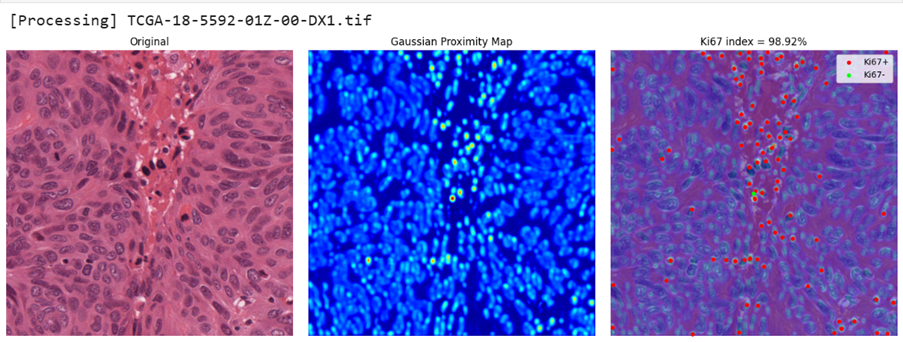
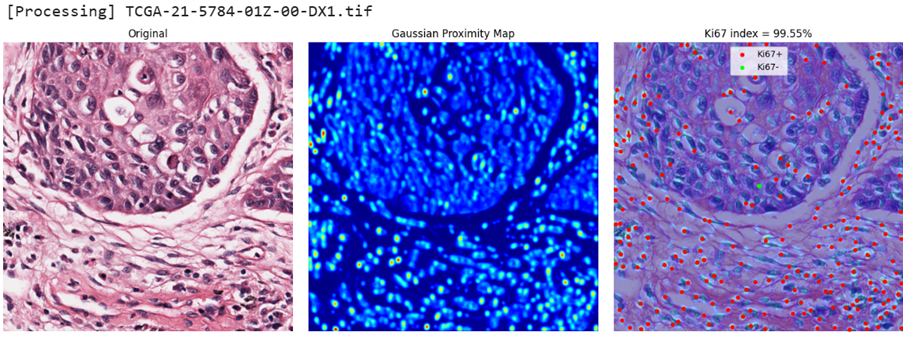
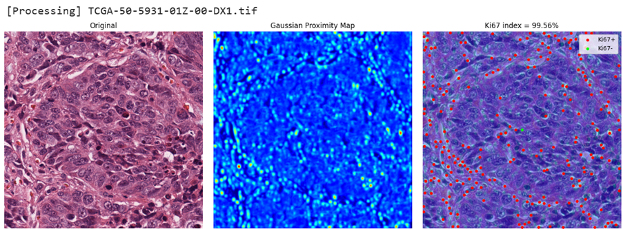

# Ki67 Proliferation Index Estimation using Deep Learning

> Focus: Medical AI | Image Segmentation | Clinical Index Estimation  

## Overview  
This project presents a deep learning pipeline for **automatic estimation of the Ki67 proliferation index** from histopathology images.  
The system detects cell nuclei, classifies Ki67-positive and negative cells, and computes a clinically relevant index.

> Note: Source code is dependent on project contract. This repository highlights methodology and results.

---

## Objectives  
- Automate **nuclei detection** in histopathology images  
- Classify **Ki67-positive vs negative cells**  
- Compute **Ki67 proliferation index** for clinical analysis  

## Pipeline
Input Image → Gaussian Map Regression → Thresholding → Centroid Extraction → Ki67 Index
-	Gaussian proximity maps encode spatial likelihood of nuclei
-	Centroids extracted via connected components
-	Ki67 index computed as ratio of positive cells to total cells

## Dataset
- MoNuSeg dataset from MoNuSeg Challenge 2018
- MoNuSeg data from Kaggle
- 1000×1000 histopathology images with corresponding masks

## Model
-	Architecture: U-Net, PI(Porliferation Index)Net
-	Input: RGB histopathology image
-	Output: Continuous Gaussian proximity map

## Technical Details
•	Framework: PyTorch
•	Libraries: OpenCV, NumPy, Matplotlib
•	Dataset: MoNuSeg (PNG/TIFF mixed formats) from Kaggle MoNuSeg 2018 dataset
  - Image analysis for proper features
•	Preprocessing:
  -	Image resizing (256×256 / 1000×1000 normalization) 
  -	Binary mask → centroid → Gaussian map conversion

### Loss Functions  
- Dice Loss  
- RMSE Loss  
- Huber Loss  
- Log-Cosh Loss  

> Multiple loss functions were explored to improve stability and convergence.

---

## Results  

### Achievements  
- Reliable nuclei detection across multiple samples  
- Successful Ki67 index computation  
- Robust performance on dense cell regions  

### Visualizations  

- Gaussian proximity maps  
- Centroid detection overlay  
- Ki67+ (red) / Ki67− (green) classification      

--
## Future Work  
- Extend image analysis
- Improve classification accuracy for Ki67-positive cells  
- Extend to multi-class histopathology tasks  
- Optimize for real-world clinical deployment  

--

## Author  
- Kara  

